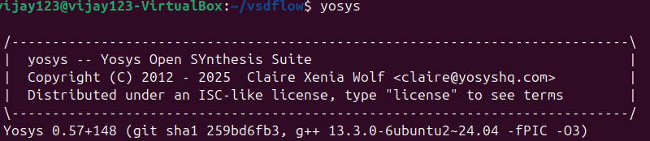
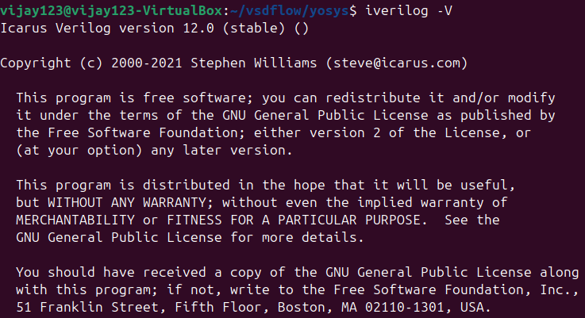
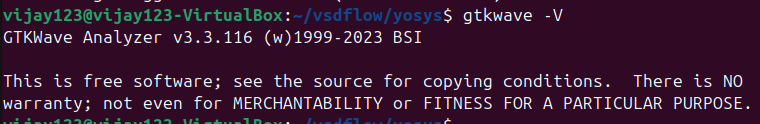

# Task 0: Tool Installation and Verification

## 📌 Objective
To install and verify the required tools for the RISC-V SoC Tapeout program.

---

## 🛠 Tools Used
### 1. Yosys
- *Purpose:* Open-source framework for RTL synthesis.
- *Use:* Converts Verilog HDL code into a gate-level netlist.

### 2. Icarus Verilog (Iverilog)
- *Purpose:* Open-source Verilog simulation tool.
- *Use:* Used for compiling and simulating Verilog code.

### 3. GTKWave
- *Purpose:* Waveform viewer.
- *Use:* Visualizes output waveforms from simulation.

---

## ✅ Verification Screenshots
- *Yosys installation check*
  

- *Iverilog installation check*
  

- *GTKWave installation check*

  
